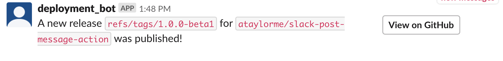

# Slack Post Message Action

## Description

A GitHub action that posts a message to Slack using [the Block format](https://api.slack.com/reference/block-kit/blocks).

## Screenshot



## Arguments

If both `block-json` and `block-json-file` are set `block-json` will take priority. 

If `block-json-file` and/or `block-json` are set the contents of `message` will not be shown in Slack. However, it is still required as the Slack API errors without it.

[GitHub Action Contexts](https://help.github.com/en/actions/automating-your-workflow-with-github-actions/contexts-and-expression-syntax-for-github-actions#contexts) can be used in `message` and `block-json`.

- `token`: (Required) A Slack API token
- `channel`: (Required) The channel to post the message in
- `message`: (Required) A text string for the message body
- `block-json`: (Optional) A JSON string containing an array of structured Slack blocks
  - If set, this will be passed as the `blocks` argument to [the Slack `chat.postMessage` API](https://api.slack.com/methods/chat.postMessage)
  - See [the Slack block reference](https://api.slack.com/reference/block-kit/blocks) and [the Slack block builder](https://api.slack.com/tools/block-kit-builder)
- `block-json-file`: (Optional) A file containing a JSON-based array of structured Slack blocks
  - If set, this will be passed as the `blocks` argument to [the Slack `chat.postMessage` API](https://api.slack.com/methods/chat.postMessage)
  - See [the Slack block reference](https://api.slack.com/reference/block-kit/blocks) and [the Slack block builder](https://api.slack.com/tools/block-kit-builder)

## Example Usage

```yml
name: Example Slack Message Workflow

on:
  release:
    types: [published]

jobs:
  slack_message:
    runs-on: ubuntu-latest

    steps:
      - uses: actions/checkout@v1
      - name: Post a message to Slack on release
        uses: ataylorme/slack-post-message-action@master
        with:
          token: "${{ secrets.SLACK_TOKEN }}"
          channel: "#github-action-test"
          message: "Hello from ${{ github.ref }} of ${{ github.repository }}"
          block-json: |
            [
              {
                  "type": "section",
                  "text": {
                      "type": "mrkdwn",
                      "text": "A new release `${{ github.ref }}` for `${{ github.repository }}` was published by ${{ github.actor }}!"
                  },
                  "accessory": {
                      "type": "button",
                      "text": {
                          "type": "plain_text",
                          "text": "View on GitHub"
                      },
                      "url": "https://github.com/${{ github.repository }}/releases/tag/${{ github.ref }}"
                  }
              }
            ]
```

## Example Block JSON

```json
[
    {
        "type": "section",
        "text": {
            "type": "mrkdwn",
            "text": "A new release `1.0.0` for `ataylorme/slack-post-message-action` was published by `ataylorme`!"
        }
    },
    {
        "type": "divider"
    },
    {
        "type": "section",
        "text": {
            "type": "mrkdwn",
            "text": "GitHub Tag: `1.0.0`"
        },
        "accessory": {
            "type": "button",
            "text": {
                "type": "plain_text",
                "text": "View on GitHub"
            },
            "url": "https://github.com/ataylorme/slack-post-message-action/releases/tag/1.0.0"
        }
    }
]
```
